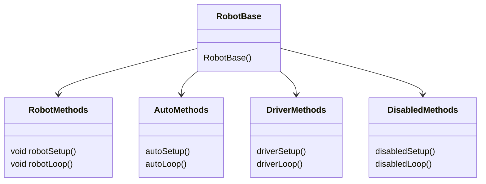
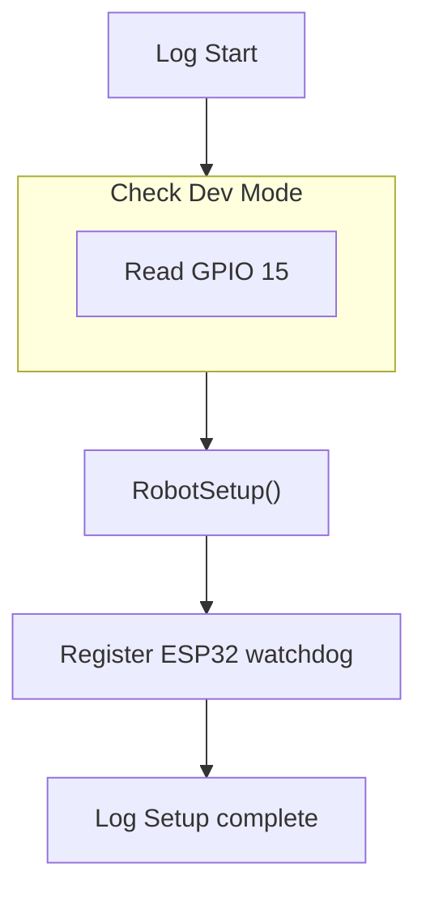

## Comms
`Comms` is the main field communication class, all data throughput from and to the field is handled by it

Comms Features:
- [ ] Connect to the MMS automatically
- [ ] Communicate successfully with the MMS
- [ ] Timesync with the MMS
- [ ] Receive game data from the MMS
- [ ] Send telemetry data to the MMS

## Logger
`Logger` is a superset of serial and the communication protocol used by MechaLib

Logger Features:
- [ ] Accept MechaLeague's datatypes (ChassisSpeeds, MotorBase, ServoBase, etc.)
- [ ] Log a formatted output to Serial
- [ ] Log a formatted and compliant output to comms

## RobotBase
This is the main class a robot program should extend, RobotBase will act as a container for the parent robot functions as described by this diagram

Startup Process:
