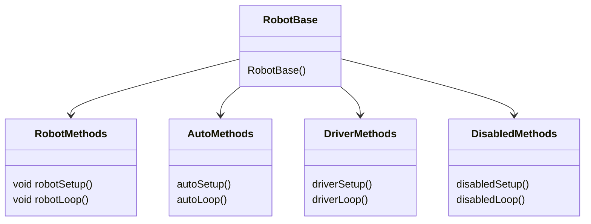

# RobotBase
This is the main class a robot program should extend, RobotBase will act as a container for the parent robot functions as described by this diagram

```mermaid
classDiagram
    RobotBase

    RobotBase : RobotBase()

    RobotMethods : void robotSetup()
    RobotMethods : void robotLoop()
    RobotBase --> RobotMethods

    AutoMethods : autoSetup()
    AutoMethods : autoLoop()
    RobotBase --> AutoMethods

    DriverMethods : driverSetup()
    DriverMethods : driverLoop()
    RobotBase --> DriverMethods

    DisabledMethods : disabledSetup()
    DisabledMethods : disabledLoop()
    RobotBase --> DisabledMethods
```