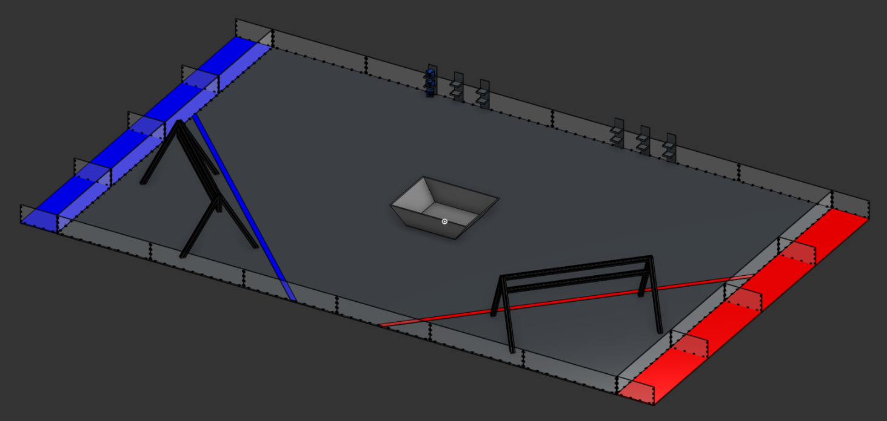
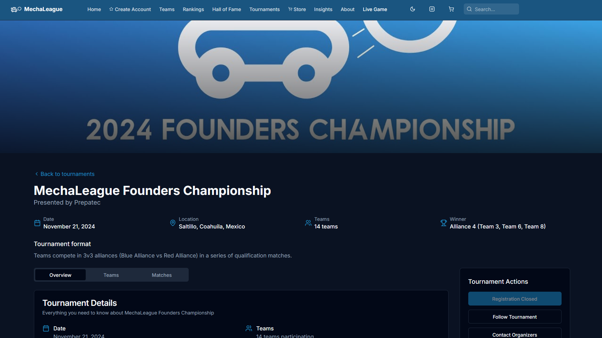

Looking for MechaLib's README? [click here](/README.md)

    
    <h3 align="center">MechaLeague Makes its Comeback</h3>
    
This summer, MechaLeague's 2nd season: <b>Chemistry Quest</b> is being realized

The work done on MechaLeague this summer consists of:
- [The Chemistry Quest challenge design](#the-challenge)
- [The MechaLeague website](#the-website)
- [The workshop done in collaboration with FRC team 3526, PrepaTec and the local government](#the-workshop)
- [MechaLib](#mechalib)

## The challenge
The challenge consists of 2 opposing alliances (Red and Blue) composed of 3 teams each, playing on opposite sides of a 2m x 3m field. The game starts with a 20 second autonomous period where they share the objective of filling their own alliance's orbits with electrons in order to achieve the valence bonus when they're filled, robots can also take neutrons and protons from their ally station and deposit them into the core for more points; robots continue this objective with a 2 minute teleoperated period where they're remote controlled by the team's driver operator, in the last 20 seconds of the game, robots can stay under or ascend on their team's reactor for an extra endgame bonus.

[Field CAD model](https://cad.onshape.com/documents/ba6518bcb4885c2b6878085e/w/0bf40196900ad0589ed0d01f/e/8d5deeb368cbbde373f27a9c?renderMode=0&uiState=68dbd9dfa284fd146393e80c)
<!-- (Other specific information not disclosed for project confidentiality) -->

## The Website
MechaLeague's official website, built with NextJS.

[Click here to visit](https://mechaleague.site/tournaments/founders-championship)

This website will evolve to be the home of MechaLeague, facilitating access to live event streams, data results and more insight into your favorite teams

## The Workshop
A winter workshop organized by FRC team Blue Ignition 3526 in colaboration with the local government to introduce over 40 students from public secondary schools into robotics and compete in MechaLeague: Chemistry Quest, giving them all the bases they need in order to have a competitive robot for the season 

## MechaLib

 

The robust, all-in-one software library for <b>MechaLeague</b> Robots
Read more [here](/README.MD)

Have any questions? HMU
- HC Slack: @ramondeleon
- Email: ramondeleonca@coahuilacreations.xyz